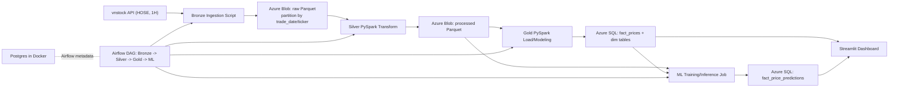

# 📈 HOSE Stock Data Warehouse & Analytics Pipeline

An end-to-end Data Engineering project that automates extraction, transformation, and visualization of Vietnam stock market data for **HOSE-listed stocks**.

This project demonstrates a production-ready, highly scalable **Medallion Architecture** built entirely on modern Data Engineering principles and containerization.

---

## 🏗️ Architecture Overview

The pipeline implements the **Medallion Architecture (Bronze ➔ Silver ➔ Gold)** to incrementally improve data structure and quality as it flows through the system.

1. **Ingestion (Bronze Layer)**: 
   - Data extraction from `vnstock` for **HOSE stock symbols**.
   - Market data is fetched at **1-hour interval (`interval="1H"`)**.
   - Raw data is stored in **Azure Blob Storage** (Data Lake) as Parquet files partitioned by `trade_date` and `ticker`.
2. **Transformation (Silver Layer)**: 
   - **PySpark** jobs read the raw data, perform data quality checks, clean missing values, normalize schemas, and calculate moving averages.
   - Cleaned data is saved back to Azure Blob Storage in the `processed` container.
3. **Serving (Gold Layer)**: 
   - PySpark loads the processed data, models it into a **Star Schema** (Fact & Dimension tables), and pushes it to an **Azure SQL Database** optimized for analytical queries.
4. **Orchestration**:
   - The entire workflow is scheduled, monitored, and orchestrated locally using **Apache Airflow** running on Docker.
5. **Visualization**:
   - A **Streamlit** dashboard deployed on Streamlit Community Cloud queries the Gold layer to provide real-time interactive financial analytics.



---

## 🛠️ Technology Stack

- **Orchestration:** Apache Airflow 2.8 (LocalExecutor)
- **Data Processing:** Apache Spark (PySpark), Pandas
- **Cloud Infrastructure:** Microsoft Azure (Blob Storage Gen2, Azure SQL Database Serverless)
- **Containerization & CI/CD:** Docker, Docker Compose, GNU Make
- **Data Visualization:** Streamlit, Plotly
- **Language:** Python 3.11.9
- **Infrastructure as Code (IaC):** Azure CLI scripting

---

## 📂 Project Structure

```bash
project/
├── dags/                     # Airflow DAGs defining the pipeline workflow
├── scripts/
│   ├── ingestion/            # Bronze: Pulling data (vnstock -> Blob Storage)
│   ├── transform/            # Silver: PySpark cleaning (Blob -> Blob)
│   └── load/                 # Gold: PySpark modeling (Blob -> Azure SQL)
├── sql/                      # DDL scripts for Azure SQL Star Schema
├── infrastructure/           # Bash scripts for automated Azure provisioning
├── streamlit_app/            # Frontend dashboard for data visualization
├── config/                   # Configuration files
├── docker-compose.yml        # Airflow cluster configuration
├── Makefile                  # Developer fast-commands
└── requirements.txt          # Python dependencies
```

---

## 🌟 Key Engineering Highlights (For Recruiters)

1. **Idempotency & Fault Tolerance:** Airflow DAGs are designed to be idempotent. Backfilling historical data or rerunning failed tasks will not result in duplicated records.
2. **Scalable Data Lake Design:** Utilizing Parquet format over CSV provides heavy compression and schema evolution capabilities. Partitioning by `trade_date` and `ticker` improves selective reads in downstream Spark jobs.
3. **Cost Optimization:** Using Azure SQL *Serverless* compute pauses the database when inactive, significantly reducing cloud operational costs for a portfolio project.
4. **Environment Isolation:** 100% Dockerized orchestration. Zero local dependencies required other than Docker and WSL2.
5. **Security Best Practices:** Absolute separation of secrets using `.env` files and Streamlit Secrets management. No hardcoded credentials in the repository.

---

## 🚀 Quick Start (Local Development)

### 1. Prerequisites
- Docker Desktop with WSL2 integration enabled.
- Azure CLI installed and authenticated.

### 2. Infrastructure Setup
Automatically provision the required Azure resources (Resource Group, Storage Account, SQL Database):
```bash
bash infrastructure/setup_azure.sh
```
*Take note of the output connection strings.*

### 3. Environment Configuration
Copy the template and fill in your Azure credentials:
```bash
cp .env.example .env
# Edit .env with your specific AZURE_STORAGE_CONNECTION_STRING and AZURE_SQL_CONNECTION_STRING
```

### 4. Launch the Pipeline
Use the provided Makefile to spin up the Airflow cluster:
```bash
make init
```
- Access the Airflow UI at `http://localhost:8080` (admin / admin).
- Trigger the `vn30_daily_pipeline` DAG to start the flow!

### 5. Launch the Dashboard
Navigate to the Streamlit app directory:
```bash
cd streamlit_app
streamlit run app.py
```
